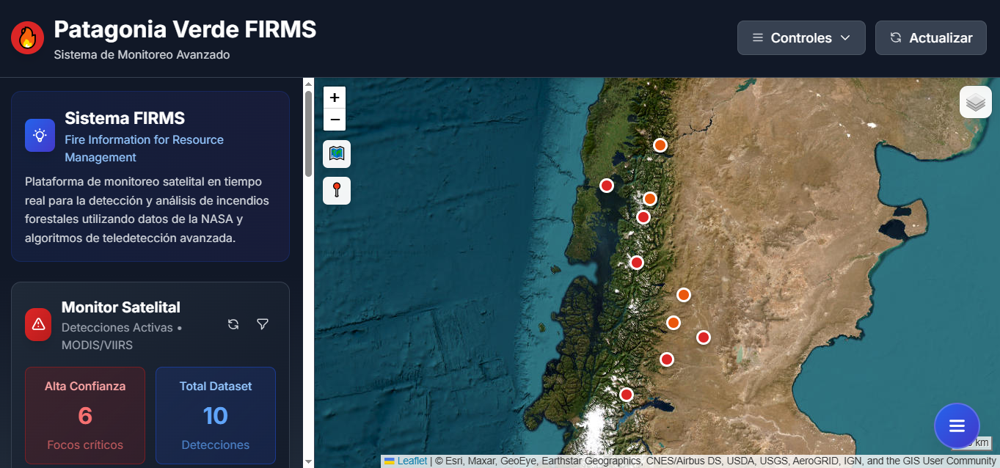

# Patagonia Verde FIRMS v1.3.0
**Sistema de Monitoreo Geoespacial de Incendios Forestales en la Patagonia Argentina**

Plataforma web profesional para analisis en tiempo real de incendios forestales mediante datos satelitales NASA FIRMS (MODIS/VIIRS). Herramienta de gestion ambiental y respuesta temprana para comunidades patagonicas.

[](https://react.dev)
[](https://typescriptlang.org)
[](https://leafletjs.com)
[](https://vitejs.dev)
[](LICENSE)
[](CHANGELOG.md)

## Vista Previa



*Sistema de monitoreo en tiempo real mostrando detecciones activas de incendios en la region patagonica con mapa interactivo y estadisticas en vivo.*

## Descripcion General

Sistema de informacion geografica (SIG) especializado en monitoreo y analisis de incendios forestales en la region patagonica. Integra datos satelitales de NASA FIRMS con tecnologias geoespaciales modernas para proporcionar visualizacion interactiva, analisis temporal y herramientas de decision en tiempo cuasi-real.

### Objetivo Principal

Democratizar el acceso a informacion geoespacial sobre incendios forestales, facilitando la deteccion temprana, respuesta coordinada y gestion ambiental proactiva por parte de comunidades locales, bomberos voluntarios, organismos gubernamentales y organizaciones ambientales.

## Caracteristicas Principales

### Sistema de Monitoreo en Tiempo Real
- Integracion directa con NASA FIRMS API (actualizacion cada 3-6 horas)
- Visualizacion de anomalias termicas detectadas por satelites MODIS (Terra/Aqua) y VIIRS (Suomi NPP/NOAA-20)
- Mapa interactivo con multiples capas cartograficas (satelital, topografico, OpenStreetMap)
- Marcadores geocodificados con informacion detallada por incendio

### Analisis Geoespacial Avanzado
- Filtros multidimensionales: rango temporal, temperatura de brillo, nivel de confianza, satelite
- Graficos de series temporales con Chart.js para identificacion de patrones estacionales
- Estadisticas agregadas: total de detecciones, incendios de alta confianza, tendencias
- Navegacion contextual por regiones patagonicas

### Interfaz de Usuario Optimizada
- Diseno responsive mobile-first con Tailwind CSS
- Menu movil flotante con navegacion rapida a todas las secciones
- Panel lateral ampliado con informacion academica y tecnica
- Controles de mapa con iconografia intuitiva y estados dinamicos
- Tipografia escalada (+20-30%) para mejor legibilidad
- Accesibilidad WCAG 2.1 Level AA (aria-labels, navegacion por teclado, alto contraste)

### Marco Teorico Academico
- Fundamentos cientificos del sistema FIRMS (NASA)
- Especificaciones tecnicas de sensores MODIS/VIIRS
- Principios de deteccion termica por infrarrojo
- Aplicaciones en gestion ambiental y respuesta a emergencias
- Contexto regional patagonico y riesgo climatico
- Limitaciones metodologicas y consideraciones tecnicas
- Referencias bibliograficas academicas

## Stack Tecnologico

### Frontend Core
- **React 19.1.0** - Framework UI con Server Components y Concurrent Rendering
- **TypeScript 5.8.3** - Tipado estatico fuerte para reduccion de errores
- **Vite 6.3.5** - Build tool de ultima generacion con HMR instantaneo

### Mapeo y Geoespacial
- **Leaflet 1.9.4** - Biblioteca de mapas interactivos de codigo abierto
- **Tiles**: OpenStreetMap, ArcGIS World Imagery (satelital), OpenTopoMap (topografico)
- **Geocodificacion inversa** para obtencion de nombres de localidades
- **Control de capas** dinamico con overlays configurables

### Visualizacion de Datos
- **Chart.js 4.4.9** - Graficos canvas altamente optimizados
- **react-chartjs-2 5.3.0** - Wrapper React con hooks y actualizaciones reactivas
- **Graficos de linea temporal** con zoom, tooltips personalizados y gradientes

### Estilizado y UI/UX
- **Tailwind CSS 3.4.17** - Framework de utilidades con theme personalizado
- **@fontsource/inter 5.2.5** - Tipografia profesional optimizada
- **Tailwind Forms & Typography** - Plugins para formularios y contenido largo
- **Animaciones CSS personalizadas**: fadeIn (overlays), slideUp (menu movil)

### Testing y Quality Assurance
- **Vitest 3.2.4** - Test runner nativo de Vite con ESM support
- **Testing Library** - Testing centrado en comportamiento del usuario
- **MSW 2.12.3** - Mock Service Worker para interceptar peticiones HTTP
- **ESLint 9.25.0** - Linter con reglas para React Hooks y TypeScript
- **TypeScript strict mode** - Verificacion estricta de tipos

### Utilidades
- **date-fns 4.1.0** - Manipulacion y formateo de fechas (tree-shakeable)
- **Express 5.1.0** - Server HTTP opcional para desarrollo local
- **CORS 2.8.5** - Configuracion CORS para integraciones API

### Monitoreo y Analytics
- **@vercel/speed-insights** - Metricas de rendimiento en tiempo real (Core Web Vitals)
- **Logger utility** - Sistema de logging con eliminacion automatica en produccion

## Instalacion y Configuracion

### Requisitos Previos
- Node.js >= 18.0.0
- npm >= 9.0.0 o pnpm >= 8.0.0
- Git

### Instalacion Local

```bash
# Clonar repositorio
git clone https://github.com/camiloquirogadev/patagonia-verde.git
cd patagonia-verde

# Instalar dependencias
npm install

# Iniciar servidor de desarrollo
npm run dev
```

El servidor de desarrollo estara disponible en `http://localhost:5173`

### Build de Produccion

```bash
# Compilar proyecto optimizado
npm run build

# Preview del build
npm run preview
```

La carpeta `dist/` contendra los archivos estaticos optimizados listos para deployment.

## Scripts Disponibles

```bash
npm run dev              # Servidor de desarrollo con HMR
npm run build            # Build de produccion optimizado
npm run preview          # Preview del build local
npm test                 # Ejecutar suite de tests
npm run test:watch       # Tests en modo watch continuo
npm run test:coverage    # Cobertura de codigo con reportes
npm run lint             # Verificar codigo con ESLint
npm run format           # Formatear codigo con Prettier
npm run deploy           # Deploy automatico a Vercel (requiere configuracion)
```

## Fuente de Datos

### NASA FIRMS (Fire Information for Resource Management System)

Sistema de informacion desarrollado por NASA Earth Science Division que proporciona datos satelitales de deteccion de incendios activos en tiempo cuasi-real.

**Caracteristicas Tecnicas**:
- **Sensores MODIS** (Moderate Resolution Imaging Spectroradiometer)
  - Satelites: Terra (AM) y Aqua (PM)
  - Resolucion espacial: 1 km
  - Bandas: 36 espectrales (0.4 - 14.4 μm)
  - Swath: 2330 km
  
- **Sensores VIIRS** (Visible Infrared Imaging Radiometer Suite)
  - Satelites: Suomi NPP y NOAA-20
  - Resolucion espacial: 375 m
  - Bandas: 22 (0.4 - 12.0 μm)
  - Mayor precision en deteccion de incendios pequeños

**Parametros de Deteccion**:
- **Brightness (Temperatura de Brillo)**: Temperatura radiometrica en Kelvin (K)
- **Confidence**: Nivel de confianza (0-100%) basado en algoritmos contextuales
- **FRP (Fire Radiative Power)**: Potencia radiativa en MW
- **ACQ_DATE/ACQ_TIME**: Fecha y hora UTC de adquisicion

**Latencia**: 3-6 horas desde sobrevuelo satelital hasta disponibilidad de datos

**Cobertura**: Global, con enfoque en region patagonica argentina (coordenadas -39 a -55 lat, -65 a -75 lon)

## Arquitectura del Sistema

### Estructura de Directorios

```
patagonia-verde/
├── src/
│   ├── components/
│   │   ├── dashboard/          # Componentes de graficos y analisis
│   │   ├── filters/            # Panel de filtros avanzados
│   │   ├── layout/             # Header, Sidebar, Footer
│   │   ├── map/                # Mapa interactivo Leaflet
│   │   ├── sidebar/            # Subsecciones del sidebar
│   │   ├── stats/              # Tarjetas de estadisticas
│   │   └── ui/                 # Componentes UI reutilizables
│   ├── hooks/                  # Custom React Hooks
│   ├── services/               # Servicios de API y data fetching
│   ├── types/                  # Definiciones TypeScript
│   ├── utils/                  # Funciones utilitarias
│   ├── config/                 # Constantes y configuracion
│   └── data/                   # Datos estaticos
├── public/                     # Assets estaticos
├── docs/                       # Documentacion tecnica
└── dist/                       # Build de produccion (generado)
```

### Rendimiento

**Bundle Size Optimizado**:
- Bundle principal: 281.27 KB → 81.14 KB (gzip)
- CSS: 71.46 KB → 16.11 KB (gzip)
- Maps chunk: 149.56 KB → 43.33 KB (gzip)
- Charts chunk: 174.08 KB → 60.95 KB (gzip)

**Optimizaciones Aplicadas**:
- Code splitting por rutas y componentes pesados
- Tree shaking de dependencias no utilizadas
- Lazy loading de graficos y mapa
- Compresion gzip/brotli en produccion
- Minificacion de JavaScript y CSS
- Prefetch de recursos criticos

## Responsividad

**Breakpoints Tailwind CSS**:
- `sm`: 640px (smartphones landscape)
- `md`: 768px (tablets)
- `lg`: 1024px (laptops)
- `xl`: 1280px (desktops)
- `2xl`: 1536px (pantallas grandes)

**Adaptaciones Mobile**:
- Menu flotante independiente con navegacion contextual
- Sidebar deslizable con overlay oscuro
- Controles de mapa redimensionados para touch
- Tipografia escalada automaticamente
- Graficos con scroll horizontal en pantallas pequeñas

## Seguridad

- **HTTPS obligatorio** en produccion
- **Content Security Policy (CSP)** configurado
- **CORS** restringido a dominios autorizados
- **Sanitizacion de inputs** en formularios
- **No almacenamiento de datos sensibles** en localStorage
- **Dependencias actualizadas** regularmente via Dependabot

Ver [SECURITY.md](SECURITY.md) para politica completa de seguridad.

## Documentacion Adicional

- [CHANGELOG.md](CHANGELOG.md) - Historial de versiones
- [docs/ARCHITECTURE.md](docs/ARCHITECTURE.md) - Arquitectura del sistema
- [docs/CONTRIBUTING.md](docs/CONTRIBUTING.md) - Guia de contribucion
- [docs/DEPLOY.md](docs/DEPLOY.md) - Guia de deployment
- [docs/SCIENTIFIC_METHODOLOGY.md](docs/SCIENTIFIC_METHODOLOGY.md) - Metodologia cientifica
- [SECURITY.md](SECURITY.md) - Politica de seguridad

## Licencia

MIT License - Software Libre y de Codigo Abierto

Copyright (c) 2024-2025 Camilo Quiroga

Ver [LICENSE](LICENSE) para detalles completos.

## Autor

**Camilo Quiroga**  
Software Engineer - Especialista en Geomatica y Analisis Geoespacial

- GitHub: [@camiloquirogadev](https://github.com/camiloquirogadev)
- Email: quirogacamilodev@gmail.com
- LinkedIn: [Camilo Quiroga](https://www.linkedin.com/in/camilo-quiroga-dev/)

## Reconocimientos

- **NASA FIRMS** por proveer datos satelitales de acceso publico
- **OpenStreetMap Contributors** por cartografia base
- **Comunidad Open Source** por herramientas y bibliotecas utilizadas
- **Universidad** por apoyo academico e institucional

---

**Proyecto Final Universitario** - Sistema de Monitoreo Ambiental  
Noviembre 2025
