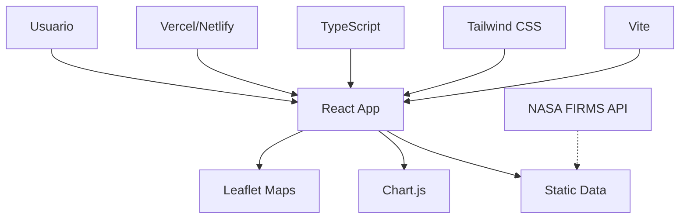

# Patagonia Verde - Monitoreo de Incendios 🔥

<p align="center">
  
  
  
  
  
</p>

Sistema de monitoreo y visualización de incendios forestales en tiempo real en la región de la Patagonia, utilizando datos satelitales de NASA FIRMS.

🌐 **[Ver Demo en Vivo](https://patagonia-verde.vercel.app)** (próximamente)

## 📸 Vista Previa

```
┌─────────────────────────────────────────────────────────────┐
│ 🔥 Patagonia Verde - Monitoreo de Incendios        [Update] │
├─────────────────────┬───────────────────────────────────────┤
│ 📊 Panel de Control │                                       │
│ ├─ Total: 127       │          🗺️ Mapa Interactivo          │
│ ├─ Filtrados: 45    │                                       │
│ └─ [Filtros...]     │     🔴 🟠 🟡 Puntos de Incendio       │
│                     │                                       │
│ 📈 Estadísticas     │    [Selector de Capas: Claro/Oscuro]  │
│ ├─ Total: 127       │                                       │
│ ├─ Alta Conf.: 89   │                                       │
│ ├─ Brillo: 325K     │           [Leyenda de Confianza]      │
│ └─ Satélites: 3     │                                       │
│                     │                                       │
│ 💝 Apoyo Proyecto   │                                       │
│ ├─ [Donar]          │                                       │
│ ├─ GitHub LinkedIn  │                                       │
│ └─ © 2025 Camilo    │                                       │
└─────────────────────┴───────────────────────────────────────┘
```

## 🌟 Características

- **Mapa interactivo** con múltiples capas (claro, oscuro, satélite)
- **Cobertura completa** de la región patagónica incluyendo Malvinas Argentinas
- **Panel de filtros avanzados** por fecha, brillo, confianza y satélite
- **Dashboard de estadísticas** en tiempo real
- **Gráficos de evolución temporal** 
- **Diseño responsive** optimizado para móvil, tablet y desktop
- **Datos satelitales FIRMS** (NASA) - MODIS, VIIRS

## 🏗️ Arquitectura



### 📁 Estructura del Proyecto
```
src/
├── components/           # Componentes de React
│   ├── dashboard/       # Gráficos y estadísticas
│   ├── filters/         # Panel de filtros
│   ├── map/            # Componente de mapa
│   └── ui/             # Componentes base (botones, loading, etc.)
├── hooks/              # Custom Hooks
│   └── useFirmsData.ts # Hook para gestión de datos
├── services/           # Lógica de servicios y APIs
├── types/              # Definiciones de TypeScript
├── data/               # Datos estáticos y ejemplos
└── test/               # Configuración de testing
```

## 🚀 Inicio Rápido

1. **Instalar dependencias:**
   ```bash
   npm install
   ```

2. **Configurar variables de entorno:**
   ```bash
   cp .env.example .env
   ```
   Edita `.env` y agrega tu token de Mapbox:
   ```
   VITE_MAPBOX_TOKEN=tu_token_aqui
   ```

3. **Ejecutar en desarrollo:**
   ```bash
   npm run dev
   ```

4. **Abrir en el navegador:**
   http://localhost:5173/

## � Deploy y Hosting

### Vercel (Recomendado)

1. **Deploy automático desde GitHub:**
   ```bash
   # Sube tu código
   git add .
   git commit -m "Ready for deployment"
   git push origin main
   
   # Ve a vercel.com, importa el repo y configura
   ```

2. **Deploy directo:**
   ```bash
   npm install -g vercel
   npm run build
   vercel --prod
   ```

### Netlify

1. **Drag & Drop:**
   ```bash
   npm run build
   # Arrastra la carpeta 'dist' a netlify.com/drop
   ```

2. **Deploy desde Git:**
   - Conecta tu repositorio en netlify.com
   - Build command: `npm run build`
   - Publish directory: `dist`

### GitHub Pages

1. **Build y deploy:**
   ```bash
   npm run build
   # Usa gh-pages para deploy
   npm install -g gh-pages
   gh-pages -d dist
   ```

## �🗺️ Token de Mapbox

Para que el mapa funcione correctamente, necesitas un token de Mapbox:

1. Visita [Mapbox](https://account.mapbox.com/access-tokens/)
2. Crea una cuenta gratuita
3. Genera un token de acceso
4. Agrégalo al archivo `.env` o como variable de entorno en tu hosting

## 🎨 Tecnologías

- **Frontend:** React 19 + TypeScript + Vite
- **Mapas:** Leaflet con CartoDB (reconoce fronteras argentinas)
- **UI:** Tailwind CSS
- **Gráficos:** Chart.js + react-chartjs-2
- **Testing:** Vitest + Testing Library
- **Deploy:** Vercel / Netlify / GitHub Pages

## 📱 Responsive Design

El diseño se adapta automáticamente a:
- **Móvil** (< 640px): Layout vertical compacto
- **Tablet** (641px - 1024px): Layout híbrido  
- **Desktop** (> 1025px): Layout completo con panel lateral

## 🔧 Scripts Disponibles

- `npm run dev` - Servidor de desarrollo
- `npm run build` - Build de producción
- `npm run preview` - Preview del build
- `npm run deploy` - Build y deploy a Vercel
- `npm run test` - Ejecutar tests
- `npm run lint` - Verificar código

## 📊 Fuentes de Datos

- **FIRMS** (Fire Information for Resource Management System) - NASA
- **Satélites:** Terra (MODIS), Aqua (MODIS), SUOMI-NPP (VIIRS), NOAA-20 (VIIRS)
- **Datos:** Temperatura de brillo, coordenadas, nivel de confianza, fecha

## 🤝 Contribuir

1. Fork del proyecto
2. Crear rama feature (`git checkout -b feature/AmazingFeature`)
3. Commit de cambios (`git commit -m 'Add: amazing feature'`)
4. Push a la rama (`git push origin feature/AmazingFeature`)
5. Abrir Pull Request

Ver [CONTRIBUTING.md](CONTRIBUTING.md) para más detalles.

## 📄 Licencia

Este proyecto está bajo la Licencia MIT. Ver `LICENSE` para más información.

---

**Desarrollado para el monitoreo ambiental de la Patagonia** 🌿
