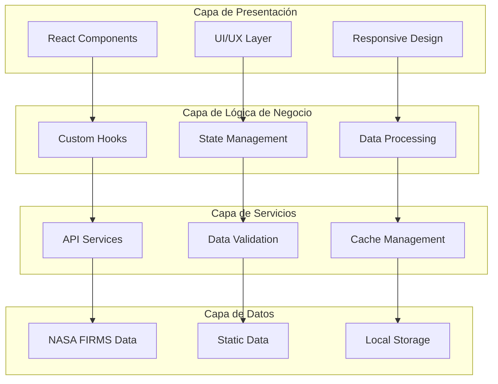

# Documentación Técnica - Arquitectura del Sistema

## Sistema de Monitoreo de Incendios Forestales Patagonia Verde

### Versión: 1.0.0 | Fecha: Octubre 2025

---

## Resumen Ejecutivo

Este documento detalla la arquitectura técnica del Sistema de Monitoreo de Incendios Forestales Patagonia Verde, una plataforma web desarrollada como proyecto personal para el análisis geoespacial de datos satelitales y la detección temprana de incendios forestales en la región patagónica argentina.

**Propósito**: Documentar las decisiones de diseño, patrones arquitectónicos y implementaciones técnicas utilizadas en el desarrollo de esta plataforma geoespacial como contribución al estudio de tecnologías GIS aplicadas al monitoreo ambiental.

## Arquitectura General

### Patrón Arquitectónico

El sistema implementa una **arquitectura por capas (Layered Architecture)** combinada con elementos de **arquitectura basada en componentes**, optimizada para aplicaciones de análisis geoespacial en tiempo real.



### Stack Tecnológico

#### Frontend Framework
- **React 19.1.0**: Framework principal con Server Components y Concurrent Features
- **TypeScript 5.8.3**: Type safety y desarrollo escalable
- **Vite 6.3.5**: Build tool optimizado para desarrollo y producción

#### Gestión de Estado
- **Custom Hooks**: Encapsulación de lógica de negocio reutilizable
- **React Context**: Compartición de estado global cuando necesario
- **LocalStorage**: Persistencia de preferencias de usuario

#### Visualización de Datos
- **Leaflet 1.9.4**: Biblioteca cartográfica para mapas interactivos
- **Chart.js 4.4.0**: Visualización de series temporales y estadísticas
- **React Chart.js 2**: Integración React para Chart.js

#### Styling y UI
- **Tailwind CSS 3.4.15**: Framework CSS utility-first
- **PostCSS**: Procesamiento CSS avanzado
- **Responsive Design**: Mobile-first approach

## Módulos Principales

### 1. Sistema de Gestión de Datos (useFirmsData Hook)

**Propósito**: Gestionar la adquisición, validación y cache de datos satelitales.

**Funcionalidades Clave**:
- Validación de integridad de datos geoespaciales
- Sistema de cache con TTL (Time To Live) de 5 minutos
- Manejo de errores robusto con fallbacks
- Optimización de memoria mediante memoización

**Algoritmos Implementados**:
```typescript
// Validación geoespacial
const validateCoordinates = (lat: number, lng: number): boolean => {
  return lat >= -90 && lat <= 90 && lng >= -180 && lng <= 180;
};

// Cache con TTL
const isCacheValid = (): boolean => {
  return cachedData && (Date.now() - cacheTimestamp) < CACHE_DURATION;
};
```

### 2. Sistema de Filtros Multidimensionales

**Propósito**: Implementar filtrado avanzado de datos satelitales con múltiples criterios.

**Dimensiones de Filtrado**:
- **Temporal**: Rango de fechas con precisión de día
- **Espectral**: Temperatura de brillo (rango configurable)
- **Confianza**: Niveles de confianza NASA FIRMS
- **Satelital**: Filtrado por plataforma específica

**Optimizaciones**:
- Debouncing de 300ms para prevenir exceso de cálculos
- Memoización con `useMemo` para resultados costosos
- Filtrado en memoria para datasets < 10,000 elementos

### 3. Sistema de Visualización Cartográfica

**Propósito**: Renderizado interactivo de datos geoespaciales.

**Componentes**:
- **MapComponent**: Contenedor principal del mapa
- **MarkerClusters**: Agrupación inteligente de puntos cercanos
- **LayerControl**: Selector de capas base y overlays
- **PopupComponent**: Visualización detallada de puntos

**Optimizaciones de Rendimiento**:
- Lazy loading de componentes pesados
- Virtual scrolling para grandes datasets
- Throttling de eventos de zoom/pan

### 4. Sistema de Análisis Temporal

**Propósito**: Procesamiento estadístico de series temporales.

**Métricas Calculadas**:
- Tendencias (algoritmo de medias móviles)
- Detección de anomalías (análisis de desviación estándar)
- Proyecciones de actividad
- Correlaciones espacio-temporales

**Algoritmos Estadísticos**:
```typescript
// Cálculo de tendencia
const calculateTrend = (values: number[]): TrendType => {
  const recentAvg = mean(values.slice(-3));
  const historicalAvg = mean(values.slice(0, 3));
  const threshold = 0.2; // 20% de cambio
  
  if (recentAvg > historicalAvg * (1 + threshold)) return 'increasing';
  if (recentAvg < historicalAvg * (1 - threshold)) return 'decreasing';
  return 'stable';
};
```

## Patrones de Diseño Implementados

### 1. Observer Pattern
- Implementado en hooks para reactividad de datos
- Subscripción automática a cambios de estado
- Limpieza automática de listeners

### 2. Strategy Pattern
- Diferentes estrategias de filtrado según tipo de datos
- Algoritmos intercambiables para análisis temporal
- Múltiples proveedores de mapas base

### 3. Factory Pattern
- Generación de componentes de visualización
- Creación de instancias de filtros dinámicos
- Constructores de queries de datos

### 4. Singleton Pattern
- Cache global de datos (implementación funcional)
- Configuración de aplicación
- Logger centralizado

## Optimizaciones de Rendimiento

### Client-Side
1. **Code Splitting**: Lazy loading de rutas y componentes
2. **Memoización**: React.memo, useMemo, useCallback
3. **Virtualization**: Para listas largas de datos
4. **Debouncing**: En inputs de filtros y búsqueda
5. **Bundle Analysis**: Optimización del tamaño de bundle

### Gestión de Memoria
1. **Cleanup de Effects**: removeEventListener en useEffect
2. **Weak References**: Para objetos temporales grandes
3. **Garbage Collection Hints**: Nulling de referencias pesadas
4. **Memory Profiling**: Herramientas de desarrollo integradas

### Network Optimization
1. **HTTP/2 Push**: Para recursos críticos
2. **Compression**: Gzip/Brotli en assets
3. **CDN Integration**: Para recursos estáticos
4. **Service Workers**: Cache inteligente offline

## Seguridad y Robustez

### Validación de Datos
```typescript
// Sanitización de inputs
const sanitizeInput = (input: unknown): string => {
  return typeof input === 'string' 
    ? input.trim().slice(0, 1000) // Límite de longitud
    : '';
};

// Validación de tipos en runtime
const validateFirePoint = (data: unknown): data is FirePoint => {
  return isObject(data) && 
         isNumber(data.latitude) &&
         isNumber(data.longitude) &&
         isValidConfidence(data.confidence);
};
```

### Error Handling
1. **Error Boundaries**: Captura de errores React
2. **Try-Catch Wrapping**: En operaciones asíncronas
3. **Fallback Strategies**: Datos por defecto cuando fallan APIs
4. **User Feedback**: Mensajes informativos de errores

### Data Integrity
1. **Type Guards**: Verificación de tipos en runtime
2. **Schema Validation**: Validación de estructura de datos
3. **Coordinate Validation**: Verificación de rangos geográficos válidos
4. **Temporal Validation**: Verificación de formatos de fecha

## Escalabilidad

### Horizontal Scaling
- Diseño stateless para múltiples instancias
- CDN para distribución geográfica
- Load balancing capabilities

### Vertical Scaling
- Lazy loading progresivo
- Memory pooling para objetos grandes
- CPU-intensive tasks en Web Workers

### Data Scaling
- Pagination para datasets grandes
- Streaming de datos en tiempo real
- Compression algorithms para transferencia

## Testing Strategy

### Unit Testing
- Vitest para lógica de negocio
- Testing Library para componentes React
- Cobertura mínima: 80%

### Integration Testing
- Testing de flujos completos usuario
- Mock de APIs externas
- Testing de performance

### E2E Testing
- Cypress para flujos críticos
- Testing cross-browser
- Performance testing automatizado

## Deployment y DevOps

### Build Process
```bash
# Optimización de producción
npm run build
# - Tree shaking automático
# - Minificación de CSS/JS
# - Asset optimization
# - Source maps para debugging
```

### CI/CD Pipeline
1. **Linting**: ESLint + Prettier
2. **Type Checking**: TypeScript strict mode
3. **Testing**: Automated test suite
4. **Build**: Production optimization
5. **Deploy**: Vercel/Netlify integration

### Monitoring
- Performance metrics collection
- Error tracking (Sentry integration ready)
- User analytics (Privacy-focused)
- Resource usage monitoring

---

**Documento elaborado por**: Camilo Quiroga  
**Fecha de elaboración**: Octubre 2025  
**Versión del documento**: 1.0.0  

*Para consultas técnicas sobre la implementación: camiloquirogadev@gmail.com*