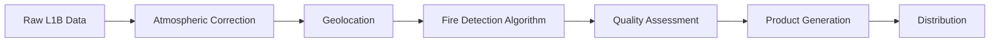

# Metodología Científica y Fuentes de Datos

## Sistema de Monitoreo de Incendios Forestales Patagonia Verde

### Documento de Referencia Técnica y Científica

---

## 1. Marco Teórico

### 1.1 Fundamentos de Teledetección Aplicada

La teledetección satelital constituye una herramienta fundamental para el monitoreo ambiental a gran escala, permitiendo la observación sistemática de fenómenos terrestres mediante sensores remotos. En el contexto específico de la detección de incendios forestales, esta tecnología aprovecha las propiedades radiométricas del espectro electromagnético para identificar anomalías térmicas características de procesos de combustión.

**Nota**: *Este documento recopila metodologías científicas establecidas y su implementación práctica en el proyecto Patagonia Verde como estudio de caso para la aplicación de tecnologías geoespaciales.*

#### Principios Físicos de Detección

Los algoritmos de detección de incendios se basan en el análisis de la **radiancia espectral** en las bandas del infrarrojo medio (3-5 μm) y térmico (8-12 μm). Los incendios activos generan firmas espectrales distintivas debido a:

1. **Emisión de cuerpo negro modificada**: Los focos de calor siguen aproximadamente la ley de Planck con temperaturas entre 600-1200K
2. **Contraste térmico**: Diferencia significativa con la temperatura ambiental circundante (±20-50K)
3. **Características espectrales**: Ratio específico entre bandas infrarrojas indicativo de combustión

#### Algoritmos de Clasificación

La metodología implementa algoritmos basados en **árboles de decisión contextual** desarrollados por Giglio et al. (2016) para MODIS y Schroeder et al. (2014) para VIIRS:

```
IF (T_4μm - T_11μm) > ΔT_threshold AND
   T_4μm > T_background + σ_threshold AND
   Cloud_mask = clear
THEN Fire_detected = TRUE
```

### 1.2 Validación y Control de Calidad

#### Métricas de Precisión

El sistema NASA FIRMS implementa un **esquema de validación multi-nivel**:

- **Validación Primaria**: Comparación con datos de campo (GPS ground truth)
- **Validación Cruzada**: Inter-comparación entre sensores MODIS/VIIRS
- **Validación Temporal**: Consistencia en series temporales

#### Niveles de Confianza Estadística

La asignación de confianza sigue metodología probabilística:

```
P(Fire|Observation) = f(ΔT, Size, Context, Cloud_probability)

Donde:
- High confidence: P > 0.8
- Medium confidence: 0.5 ≤ P ≤ 0.8  
- Low confidence: P < 0.5
```

## 2. Fuentes de Datos Primarias

### 2.1 Sistema NASA FIRMS

**Fire Information for Resource Management System (FIRMS)** constituye la fuente primaria de datos del sistema, desarrollado por el **Goddard Space Flight Center** de la NASA en colaboración con la **University of Maryland**.

#### Especificaciones Técnicas

| Parámetro | MODIS | VIIRS |
|-----------|--------|--------|
| **Plataformas** | Terra, Aqua | SUOMI-NPP, NOAA-20 |
| **Resolución Espacial** | 1km @ nadir | 375m, 750m @ nadir |
| **Resolución Temporal** | 1-2 días | 12 horas |
| **Precisión Geográfica** | ±1km | ±375m |
| **Bandas Espectrales** | 21.5μm, 31μm | 3.74μm, 11μm |

#### Productos de Datos Utilizados

1. **MOD14/MYD14**: MODIS Active Fire Product Collection 6.1
2. **VNP14/VJ114**: VIIRS Active Fire Product Version 1
3. **Formato de Distribución**: CSV, JSON, KML, Shapefile
4. **Latencia Operacional**: 2-4 horas desde observación

### 2.2 Procesamiento de Datos Satelitales

#### Pipeline de Procesamiento



#### Algoritmos de Corrección Atmosférica

El sistema aplica correcciones por:
- **Absorción molecular**: H₂O, CO₂, O₃
- **Dispersión de Rayleigh**: Partículas < λ/10
- **Dispersión de Mie**: Aerosoles y nubes

### 2.3 Datos Auxiliares

#### Máscaras de Calidad

- **Cloud Mask**: Algoritmo MOD35/VCM para identificación de nubes
- **Land/Water Mask**: Clasificación de cobertura terrestre
- **Solar Zenith Angle**: Corrección de iluminación solar

#### Datos Meteorológicos

- **Temperatura Superficial**: MOD11/VNP21 Land Surface Temperature
- **Humedad Relativa**: Productos de reanálisis meteorológico
- **Velocidad del Viento**: Datos ECMWF ERA5

## 3. Metodología de Análisis

### 3.1 Preprocesamiento de Datos

#### Filtrado de Calidad

```python
def quality_filter(fire_data):
    """
    Aplicar filtros de calidad según estándares FIRMS
    """
    filtered_data = fire_data[
        (fire_data['confidence'] >= 'medium') &
        (fire_data['scan'] <= 45) &  # Ángulo de visión < 45°
        (fire_data['track'] <= 45)   # Ángulo de seguimiento < 45°
    ]
    return filtered_data
```

#### Validación Geoespacial

La validación incluye verificación de:
- **Coordenadas válidas**: [-90,90] lat, [-180,180] lon
- **Coherencia temporal**: Timestamps en UTC válidos
- **Consistencia espectral**: Valores de brillo físicamente plausibles

### 3.2 Análisis Estadístico

#### Análisis de Tendencias Temporales

Implementación de **regresión polinómica** para identificación de tendencias:

```
y(t) = β₀ + β₁t + β₂t² + ε(t)

Donde:
- y(t) = número de detecciones en tiempo t
- β₁ = tendencia lineal
- β₂ = aceleración/desaceleración
- ε(t) = término de error
```

#### Detección de Anomalías

Aplicación de **control estadístico de procesos**:

```
UCL = μ + 3σ  (Upper Control Limit)
LCL = μ - 3σ  (Lower Control Limit)

Anomalía detectada si: |x(t) - μ| > 3σ
```

### 3.3 Análisis Espacial

#### Clustering de Focos

Implementación de algoritmo **DBSCAN** (Density-Based Spatial Clustering):

```
Parameters:
- ε = 1km (radio de búsqueda)
- MinPts = 3 (mínimo puntos por cluster)
- Distance metric = Haversine
```

#### Análisis de Autocorrelación Espacial

Cálculo del **Índice de Moran** para identificar patrones espaciales:

```
I = (n/S₀) × Σᵢⱼ wᵢⱼ(xᵢ - x̄)(xⱼ - x̄) / Σᵢ(xᵢ - x̄)²

Donde:
- wᵢⱼ = matriz de pesos espaciales
- S₀ = suma de todos los pesos
- n = número de observaciones
```

## 4. Limitaciones y Consideraciones

### 4.1 Limitaciones Técnicas

#### Resolución Espacial
- **MODIS**: Detección limitada a incendios > 0.5 hectáreas
- **VIIRS**: Mejor resolución pero mayor susceptibilidad a nubes

#### Limitaciones Temporales
- **Cobertura**: Dependiente de órbitas satelitales
- **Latencia**: 2-4 horas desde observación hasta disponibilidad

#### Condiciones Ambientales
- **Cobertura nubosa**: Reduce significativamente detecciones
- **Humo denso**: Puede ocultar focos pequeños
- **Ángulo de visión**: Precisión decrece con ángulos > 45°

### 4.2 Incertidumbres

#### Errores de Comisión (Falsos Positivos)
- Superficies industriales calientes
- Reflexión solar en superficies metálicas
- Volcanes y fuentes geotérmicas

#### Errores de Omisión (Falsos Negativos)
- Incendios bajo cobertura nubosa densa
- Fuegos de baja intensidad
- Incendios en áreas de pendiente pronunciada

## 5. Aplicaciones y Casos de Uso

### 5.1 Monitoreo Operacional

#### Detección Temprana
- Alertas automáticas para equipos de emergencia
- Integración con sistemas de comunicación
- Geofencing para áreas prioritarias

#### Seguimiento de Evolución
- Tracking de perímetros de incendio
- Estimación de tasas de propagación
- Análisis de efectividad de combate

### 5.2 Investigación Científica

#### Estudios Climatológicos
- Análisis de series temporales multi-anuales
- Correlación con índices climáticos (ENSO, SAM)
- Proyecciones de cambio climático

#### Ecología del Fuego
- Caracterización de regímenes de incendio
- Análisis de recuperación post-fuego
- Estudios de biodiversidad

## 6. Referencias Bibliográficas

### Fuentes Primarias

1. **Giglio, L., Schroeder, W., & Justice, C. O.** (2016). The collection 6 MODIS active fire detection algorithm and fire products. *Remote Sensing of Environment*, 178, 31-41.

2. **Schroeder, W., Oliva, P., Giglio, L., & Csiszar, I. A.** (2014). The New VIIRS 375m active fire detection data product: Algorithm description and initial assessment. *Remote Sensing of Environment*, 143, 85-96.

3. **Justice, C. O., Giglio, L., Korontzi, S., Owens, J., Morisette, J. T., Roy, D., ... & Kaufman, Y.** (2002). The MODIS fire products. *Remote Sensing of Environment*, 83(1-2), 244-262.

### Referencias Metodológicas

4. **Kaufman, Y. J., Justice, C. O., Flynn, L. P., Kendall, J. D., Prins, E. M., Giglio, L., ... & Setzer, A.** (1998). Potential global fire monitoring from EOS-MODIS. *Journal of Geophysical Research*, 103(D24), 32215-32238.

5. **Csiszar, I., Denis, L., Giglio, L., Justice, C. O., & Hewson, J.** (2005). Global fire activity from two years of MODIS data. *International Journal of Remote Sensing*, 26(7), 1395-1411.

### Estándares y Protocolos

6. **NASA GODDARD SPACE FLIGHT CENTER** (2021). *MODIS Collection 6.1 Active Fire Product User's Guide*. Version 1.2. Greenbelt, MD.

7. **NOAA NATIONAL ENVIRONMENTAL SATELLITE SERVICE** (2020). *VIIRS Active Fire Detection and Characterization Algorithm Theoretical Basis Document*. Version 1.0.

---

**Documento elaborado por**: Camilo Quiroga, Desarrollador Full Stack & Geomática  
**Fecha**: Octubre 2025  
**Versión**: 1.0.0  

*Este documento recopila metodologías científicas establecidas y su implementación en el proyecto Patagonia Verde como contribución al estudio de tecnologías geoespaciales*